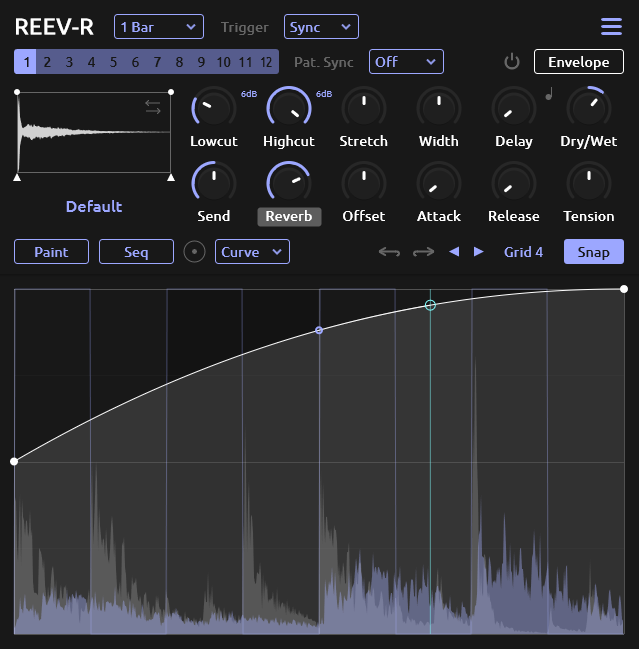

<h1 align="center">
  <!--  -->
  REEV-R
  <br>
</h1>
<div align="center">

[](https://github.com/tiagolr/reevr/releases)
[](https://github.com/tiagolr/reevr/releases)
[](https://github.com/tiagolr/reevr/releases)

</div>
<div align="center">

[](https://github.com/tiagolr/reevr/releases/latest)


</div>

**REEV-R** is a cross-platform filter modulator inspired by plugins like ShaperBox and FilterShaper. It is the second version of [FLTR-1 JSFX](https://github.com/tiagolr/tilr_jsfx?tab=readme-ov-file#fltr-1) for the Reaper DAW.

<div align="center">



</div>


Also check other plugins from this collection:

* [GATE-12](https://github.com/tiagolr/gate12) - An envelope generator for volume/gate control.
* [TIME-12](https://github.com/tiagolr/time12) - An envelope based delay modulator.

## Features

  * 6 Unique filters with different slopes and modes
  * 5 Modes per filter (LP, BP, HP, Notch and Peak)
  * 12 patterns triggered by midi notes
  * Paint mode with user defined shapes
  * Point type - hold, curve, s-curve, stairs ..
  * Built-in sequencer and randomizer
  * Envelope followers for resonance and cutoff
  * Tempo sync or lfo rate (Hz)
  * Attack and release smooth
  * Pre and post waveform display
  * MIDI trigger mode
  * Audio trigger mode

## Download

* [Download latest release](https://github.com/tiagolr/reevr/releases)
* Current builds include VST3 and LV2 for Windows, Linux and macOS plus AU for macOS.
* Clap is planned when there is official [JUCE support](https://juce.com/blog/juce-roadmap-update-q3-2024/).

## About

REEV-R is an envelope generator plugin that applies the same engine of GATE-12 and TIME-12 to filter modulation. it includes 6 unique filters, three of them grabbed from [Saikes Yutani Bass](https://github.com/JoepVanlier/JSFX) (303, MS-20 and Linear), a Moog filter which is the JUCEs stock ladder filter adapted to this project and finally an Analog/Sallen Key and Phaser filters which were broght from [Vital](https://github.com/mtytel/vital) synth source code.

### Features

#### Point types

Like GrossBeat, REEV-R includes 8 point types that can be changed by right clicking a point, the default point type can also be changed in the tools-bar.


#### Paint mode

Paint mode was remade in version 2, it now works with custom patterns that can be edited like the main audio patterns and rescaled before placing on view.

This mode has to be activated by clicking the `Paint` button, a list of patterns will show above the editor window.


There are 32 patterns that can be used and edited, these patterns are saved in the settings file and shared by any instances of the plugin.

#### Self repeating patterns

Patterns are not constrained by start and endpoints like they used to, they can have only one point or no points, this mainly allows patterns to be seamlessly rotated to create new rhythm variations.

#### Multi-point selections

Multiple points can be selected and moved around, the selections can also be scaled and skewed by holding `Alt + drag` the leftmost or rightmost handles, this allows to quickly make rising or falling wedges as well as compress or expand sets of points.


#### Audio Trigger

Audio transients can be used to trigger the envelope or restart its cycle, its heavily based on ShaperBox and includes two modes of detection: *Simple* - based on envelope following and *Drums* - based on total energy during a small time window. This feature is also heavily based on ShaperBox and also allows to use sidechain as input.

#### MIDI Trigger

MIDI can be used to trigger the envelope or restart its cycle, it can also be used to change patterns (defaults to channel 10).

#### Pattern sync

Pattern changes can be synced to the playback beat position, this allows for to make timely transitions in real time in sync with the song position.

#### Sequencer

Clicking the `Seq` button toggles the sequencer mode where patterns can be built and randomized with ease.


The left buttons are the edit mode used when clicking the view. On the right there is a row of shapes used to draw on the view and below is the randomization of the current selected mode.

After creating a sequence click `Apply` to save it as the current pattern and edit from there.

## Tips

- `Shift` for fine slider adjustments.
- `Shift` toggles snap on/off.
- `Mouse wheel` on view changes grid size
- `Right click` points changes point type.
- `Alt + drag` selection handles skews selected points.
- `Right click + drag` in paint mode changes paint tool tension.
- `Shift + mouse wheel` on sequencer to change step size.

## MacOS

MacOS builds are untested and unsigned, please let me know of any issues by opening a ticket, don't expect a promptly fix as I don't have access to that OS.

Because the builds are unsigned you may have to run the following commands:

```bash
sudo xattr -dr com.apple.quarantine /path/to/your/plugins/reevr.component
sudo xattr -dr com.apple.quarantine /path/to/your/plugins/reevr.vst3
sudo xattr -dr com.apple.quarantine /path/to/your/plugins/reevr.lv3
```

The commands above will recursively remove the quarantine flag from the plugins.

## Build

```bash
git clone --recurse-submodules https://github.com/tiagolr/reevr.git

# windows
cmake -G "Visual Studio 17 2022" -DCMAKE_BUILD_TYPE=Release -S . -B ./build

# linux
sudo apt update
sudo apt-get install libx11-dev libfreetype-dev libfontconfig1-dev libasound2-dev libxrandr-dev libxinerama-dev libxcursor-dev
cmake -G "Unix Makefiles" -DCMAKE_BUILD_TYPE=Release -S . -B ./build
cmake --build ./build --config Release

# macOS
cmake -G "Unix Makefiles" -DCMAKE_BUILD_TYPE=Release -DCMAKE_OSX_ARCHITECTURES="x86_64;arm64" -S . -B ./build
cmake --build ./build --config Release
```
